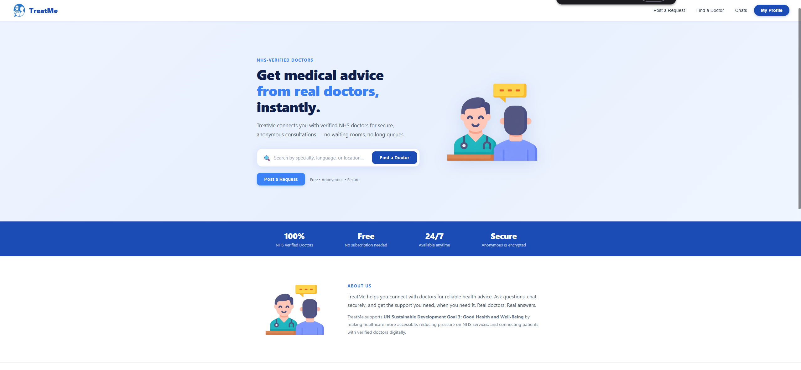
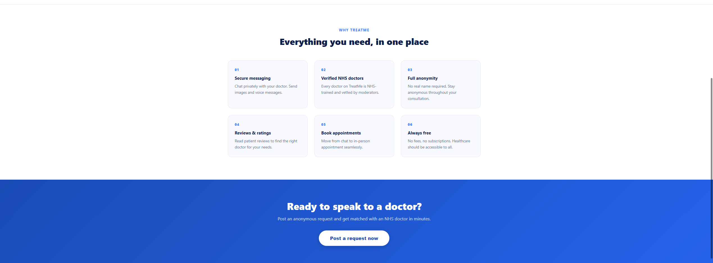
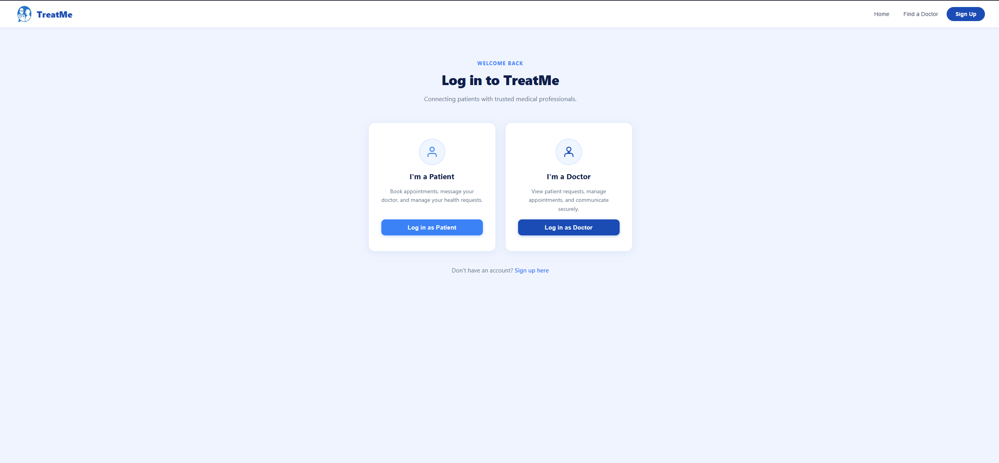
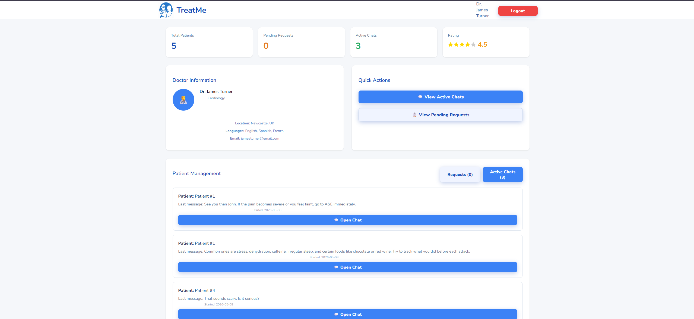
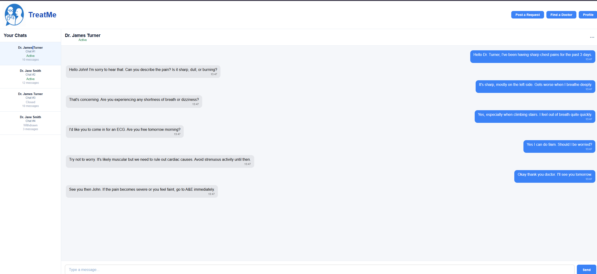
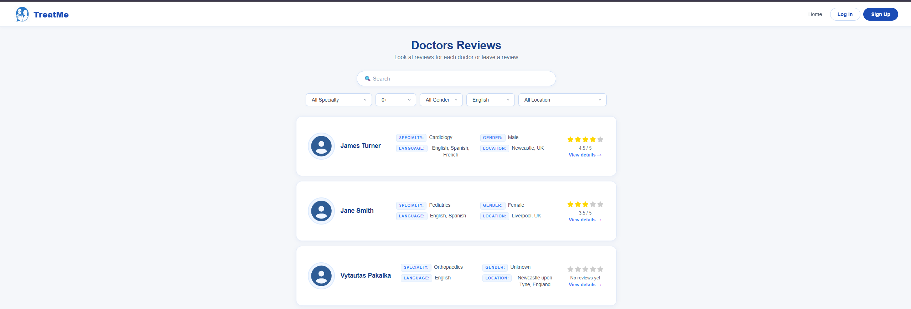
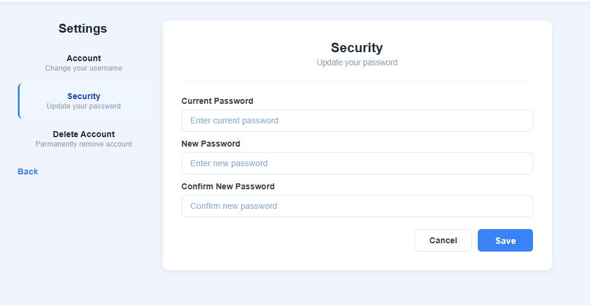
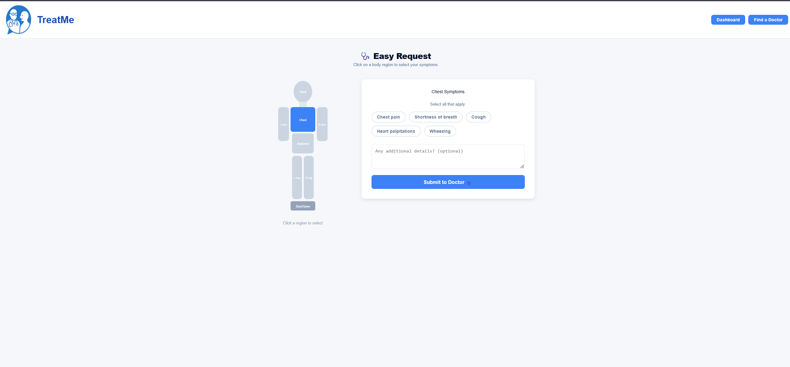
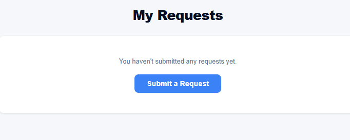
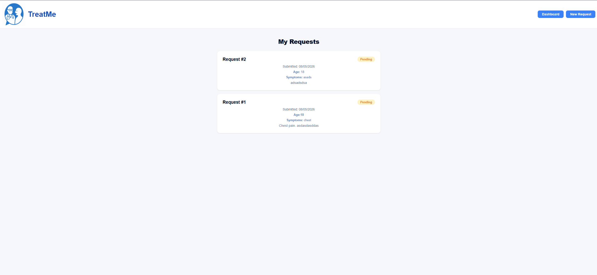

# TreatMe

An application that connects healthcare professionals with patients seeking non-urgent medical advice.


## github repository:

https://github.com/vytcka/Doctor-patient-app

## Description

TreatMe is a digital healthcare platform designed to connect patients with qualified healthcare professionals for non-urgent medical advice.
Patients begin by signing up and then completing a health questionnaire covering their symptoms and relevant medical history. Based on this input, the system matches them with a suitable heathcare professional. This ensures that advice is relevant and personalised. 
Our application also enables doctors to sign up and provide medical guidance to patients seeking assistance. Doctors are required to submit relevant qualifications during registration to ensure patients receive legitimate healthcare advice.

### Launching the project

navigate to the root directory and run these commands
```bash
docker compose down -v
docker compose build --no-cache
docker compose up
```
## Key Features

- **Secure Messaging System**
  
  Patients and doctors can communicate through a private, secure messaging channel.
- **Verified NHS Professionals**
  
  All doctors on the platform are qualified NHS doctors, ensuring users are receiving trusted and reliable medical advice.
- **Five-Star Rating System**
  
  Patients can rate their experience after each consultation. Ratings are displayed on doctor profiles to promote user transparency.
- **Doctor Filtering**
  
  Users can filter healthcare professionals based on criteria such as rating, gender, and language, to increase the chance of a positive match.
- **Role-Based Authentication**

  Users can sign up and log in as either a patient or a doctor, with access to features specific to their role.
- **Free-to-Use Service**
  
  The platform is designed to be accessible to all users without cost, improving healthcare accessibility.

-  **Request & Approval Notification Flow**

    Patients do not just "message" doctors; they submit a medical request. This creates a notification-style workflow where:
   A Patient sends a request (symptoms/details).
  A Doctor reviews the pending requests in their dashboard.
  Once Approved, a secure chat channel is initiated, notifying both parties that the consultation has begun.

-  **Gamified Health Quiz**

    To promote health literacy, signed-in users have access to an interactive Health Quiz.
    Earn Points: Gain points based on question difficulty.
   Level Up: Progress through five mastery levels (Novice to Master).
   Unlock Badges: Earn visual badges for achievements like "First Consult" or "Quick Responder."

-  **CI-Protected Workflow**
    To maintain high code quality, our main branch is protected. We have implemented CI (Continuous Integration) workflows that automatically run the Pytest suite whenever a Pull Request is made. Code cannot be merged unless it passes all functional tests.

## 🛠 Technologies Used
Frontend: React.js (Component-based UI with gamification features).
Backend: Flask (Python-based micro-framework).
Data Layer: SQLAlchemy ORM (Used to enforce strict schemas and ensure clean, validated data movement between the app and the DB).
Deployment: Docker & Docker Compose (Simplifies launching and scaling).
Security: Bcrypt (hashing) and Fernet (Symmetric encryption for sensitive medical bios).

## Rationale

The purpose of our application is to improve healthare accessbility and reduce pressure on traditional healthcare services. 
Our application is an easier solution for patients in rural areas and we provide faster access to medical advice for non-urgent issues. TreatMe aims to work alongside GPs to help reduce waiting times for patients. 

## Visuals

### Homepage




### Login Page


### Request Form


### Doctor Profile Page


### Profile page


### Chat message mode


### doctor list


### Settings



### Quick form submission



### Users requests page






### Requirements
Before running the project, ensure you have installed:
- Node.js (https://nodejs.org/)
- Python 3.10+
- pip (Python package manager)
- vscode-pdf (to view Contribution Matrix)

### Clone the repository
```bash
git clone https://github.com/vytcka/Doctor-patient-app.git
```

### Navigate to the project directory
```bash
cd Doctor-patient-app
```

### run docker
```bash
docker-compose up --build

Open: http://localhost:3000
 
 
## Test Accounts (Seed Data)
 
| Role | Username | Password |
|------|----------|----------|
| Patient | patient1@email.com | Patientpass!23 |
| Doctor | jamesturner@email.com | Doctorpass!23 |
| Doctor | janesmith@email.com | Doctorpass!23 |
| Moderator | moderator1@email.com | Moderatorpass!23 |


## Testing
 
Run the test suite:
```bash
python -m pytest flaskServer/tests/ -v
```
 
Generate HTML test report:
```bash
python -m pytest flaskServer/tests/ -v --html=docs/test_report.html
```
 
Test results and HTML report are located in `docs/test_report.html`.

## Mapping Criteria to Your Codebase

This table shows where each criteria is implemented in the TreatMe project.

| **Criteria** | **Where to Find It (File Paths, Links, or Explanations)** |
|--------------|-----------------------------------------------------------|
| **Team Standards: Cohesion** | Consistent Flask Blueprint pattern in `flaskServer/routes.py`. React component structure in `client/src/`. Coding standards documented in `teamLetter.md`. All routes return JSON. All components use inline styles with consistent design tokens (see `client/src/Home.js` for navbar pattern used across all pages). |
| **Team Standards: Documentation** |  Docstrings on all Flask routes in `flaskServer/routes.py`. Inline comments throughout `flaskServer/models.py`, `flaskServer/forms.py`, and React components in `client/src/`. Main docs in `README.md` and `teamLetter.md`. |
| **Team Standards: Version Control Workflow** | GitHub: https://github.com/vytcka/Doctor-patient-app. Feature branches used per developer. PRs used to merge into `main`. Commit history shows incremental feature development. |
| **Design & Structure** | Frontend split into individual React components in `client/src/` (one component per file). Backend uses Flask Blueprints (`flaskServer/routes.py`), models (`flaskServer/models.py`), forms (`flaskServer/forms.py`), config (`flaskServer/config.py`), and utility functions (`flaskServer/utility.py`). |
| **GUI: Clever and Interesting Design** | Screenshots in `docs/`. Key pages: `client/src/Home.js` (homepage), `client/src/Dashboard.js` (patient dashboard with badges/points), `client/src/DoctorDashboard.js`, `client/src/ModeratorDashboard.js`, `client/src/Search.js`, `client/src/Chat.js`. Consistent navbar, blue design system, SVG avatars, responsive layout. |
| **Testing Documentation** | Test files: `flaskServer/tests/test_file.py` (24 tests), `flaskServer/tests/conftest.py`. HTML report: `docs/test_report.html`. Covers: patient/doctor/moderator login, registration, edge cases (banned/suspended accounts, missing fields, duplicate usernames), logout, filtering, reviews, password change, account deletion. Run with `pytest flaskServer/tests/ -v`. |
| **Functionality and Features** | Authentication: `flaskServer/routes.py` (`/login`, `/register`, `/doctor/login`, `/moderator/login`). Chat: `client/src/Chat.js` + `flaskServer/routes.py` (`/chat`). Reviews: `client/src/DoctorReview.js` + `/submit-review`, `/doctor/reviews`. Moderation: `client/src/ModeratorDashboard.js` + multiple moderator routes. Requests: `client/src/PostRequest.js` + `/new-request`. Filtering: `client/src/Search.js` + `/filter`. Points/badges: `flaskServer/models.py` (User model). Encryption: bcrypt passwords + Fernet bio encryption in `flaskServer/models.py`.  |

## Authors and acknowledgment

- Boshra Chaanoune
- Farrell Choubeun Kepngang
- Sophie Jennings
- Benjamin Middlecote
- Fruitfulness Omoragbon
- Vytautas Pakalka
- Kunmira Yantavej


## License

[MIT]
[MIT](https://choosealicense.com/licenses/mit/)
